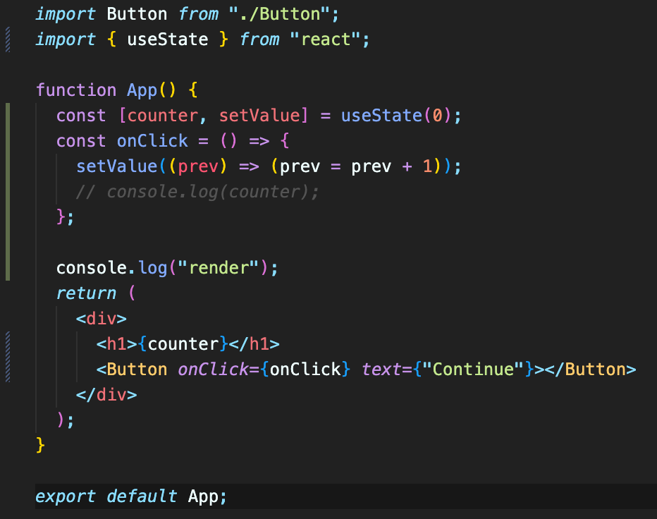
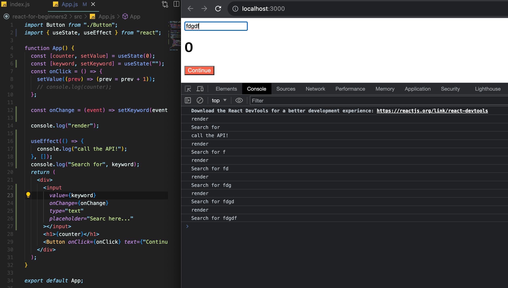
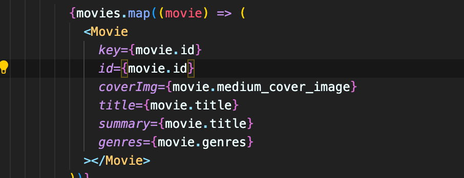

# ReactJS으로 영화 웹 서비스 만들기-2

- [ReactJS으로 영화 웹 서비스 만들기-2](#reactjs으로-영화-웹-서비스-만들기-2)
- [2 THE BASICS OF REACT](#2-the-basics-of-react)
  - [- 2.0 Introduction](#--20-introduction)
  - [- 2.1 Before React](#--21-before-react)
  - [- 2.2 Our First React Element](#--22-our-first-react-element)
  - [- 2.3 Events in React](#--23-events-in-react)
  - [- 2.4 Recap](#--24-recap)
  - [- 2.5 JSX (JavaScript XML)](#--25-jsx-javascript-xml)
  - [- 2.6 JSX part Two](#--26-jsx-part-two)
- [3 STATE](#3-state)
  - [- 3.0 Understanding State](#--30-understanding-state)
  - [- 3.1 setState part One](#--31-setstate-part-one)
  - [- 3.2 setState part Two](#--32-setstate-part-two)
  - [- 3.3 Recap](#--33-recap)
  - [- 3.4 State Function](#--34-state-function)
  - [- 3.5 Input and State](#--35-input-and-state)
  - [- 3.6 State Practice part One](#--36-state-practice-part-one)
  - [- 3.7 State Practice part Two](#--37-state-practice-part-two)
  - [- 3.8 Recap](#--38-recap)
  - [- 3.9 Final Practice and Recap](#--39-final-practice-and-recap)
- [4 PROPS](#4-props)
  - [- 4.0 props](#--40-props)
  - [- 4.1 Memo](#--41-memo)
  - [- 4.2 Props Types](#--42-props-types)
  - [- 4.3 Recap](#--43-recap)
- [5 CREATE REACT APP](#5-create-react-app)
  - [- 5.0 Introduction](#--50-introduction)
  - [- 5.1 Tour of CRA](#--51-tour-of-cra)
- [6 EFFECTS](#6-effects)
  - [- 6.0 Introduction](#--60-introduction)
  - [- 6.1 useEffect](#--61-useeffect)
  - [- 6.2 Deps](#--62-deps)
  - [- 6.4 Cleanup](#--64-cleanup)
- [7 PRACTICE MOVIE APP](#7-practice-movie-app)
  - [- 7.0 To Do List part One](#--70-to-do-list-part-one)
  - [- 7.1 To Do List part Two](#--71-to-do-list-part-two)
  - [- 7.2 Coin Tracker](#--72-coin-tracker)
  - [- 7.3 Movies App part One](#--73-movies-app-part-one)
  - [- 7.4 Movies App part Two](#--74-movies-app-part-two)
  - [- React Router](#--react-router)
  - [- 7.6 Parameters](#--76-parameters)
  - [- 7.7 Publishing](#--77-publishing)
  - [- 7.9 Style](#--79-style)

# 2 THE BASICS OF REACT

### - 2.0 Introduction

리액트는 interactive한 웹사이트를 만들기 위해서 쓴다.

 

### - 2.1 Before React

바닐라 js를 이용한 코드 작성을 해봄.

 

### - 2.2 Our First React Element

HTML을 이용하지 않고 javascript 와 ReactJS만을 이용해서 element를 생성할 것이다.

ReactJS는 HTML을 생성한다.
ReactJS는 엔진. Interactive한 UI를 만들 수 있게 함.

ReactDOM is library (or package). It makes all React Elements can be into HTML body.

- `ReactDOM.render([리액트 요소])` : 리액트 요소를 HTML 요소로 만들어 배치한다는 뜻. 사용자에게 보여지도록 하는 것.

 

### - 2.3 Events in React

eventListener 대신에 React에서 바로 event 관리하는 방법.

코드 작성

property 자리에 object로 넣어주면 됨. (props?)

결과

h3 위에 마우스를 올리거나 버튼을 클릭하면 console에 찍힌다.

 

### - 2.4 Recap

개발자로서 앞으로 이렇게 프로그램을 짤 일은 없다. 즉, 앞으로는 createElement를 사용하지 않는다.(다른 방법 사용.)

 

### - 2.5 JSX (JavaScript XML)

HTML에서 사용한 문법과 비슷한 문법으로 리액트 요소를 만들 수 있게 해준다.

코드 작성

아래 형식으로 작성하고 babel을 설치하면 JSX 문법을 사용할 수 있다.

https://unpkg.com/@babel/standalone/babel.min.js

 

### - 2.6 JSX part Two

먼저, Title과 Button을 함수로 만들어 준다.

`() =>` 쓰면 함수로 만들어 줄 수 있음(arrow funtion)

이렇게 return 써서 함수 만드는 거랑 완전히 같음.

컴포넌트의 이니셜은 반드시 대문자로.
저 노란색 자리에 return 값이 들어간다고 생각하면 됨. 실제로 컴포넌트를 나누지 않고 저기다 그냥 한번에 적어도 상관 없음.

마지막으로 Container도 함수로 만들어주고 컴포넌트를 렌더링 하면 된다.

 

# 3 STATE

### - 3.0 Understanding State

변수들을 JSX에 전달하는 방법을 알아야 한다.

혹은 함수를 새로 만들어서

버튼을 누를 때마다 counter가 바뀌도록 설정.

UI는 변하지 않지만 counter는 제대로 증가하고 있는 것을 확인.

countUp 함수가 실행될 때 마다 re-rendering 시켜주면 ui도 새로고침 된다.

아예 render라는 함수를 새로 정의해서 사용.

여기서 바닐라 js랑 차이점은, counter가 바뀌면서 span 전체가 새로고침 되는게 아니라 {counter} 부분만 re-rendering 된다.

 

### - 3.1 setState part One

이제 React.js 어플 내에서 데이터를 보관하고 자동으로 리랜더링을 일으킬 수 있는 방법을 배운다.(트리거가 발동해서 리랜더링 시켜줌)

(일단 데이터를 let 변수에 담는 것이 기존의 컨셉이었다.)

- `React.useState([초기값])`
  
  여기서 undifined 된 부분이 데이터고, 뒤에 f가 data를 바꿀때 하용하는 함수.

> - 배열에서 item을 꺼내서 각각의 변수에 담는 법
>   
>   이렇게 하면 myFavFood는 tomato가 되고, mySecondFavFood는 potato가 된다.

배열에 이름을 붙여줌.

 

### - 3.2 setState part Two

counter가 바뀌기 때문에 let으로 바꿔주고, 버튼에 이벤트 리스너 달고, 함수 만들어서 실행시켜주면 counter가 잘 올라가고 있다.

이까지는 앞과 동일하고, 어떻게 리랜더링 시켜줄 것인지가 문제.

- modifier function : 데이터를 그 값으로 업데이트 한 후 자동으로 리랜더링을 일으킨다.

다시 const로 선언한 거 잘 봐라. modifier로 데이터 값을 바꾸면 const로 선언해도 된다.

 

### - 3.3 Recap

React.js에서는 데이터가 바뀔때마다 컴포넌트를 리랜더링하고 UI를 refresh한다.

 

### - 3.4 State Function

- `[function name]([현재 값] => [현재 값에 연산])` :
  이전 데이터를 바탕으로 새로운 데이터를 설정하고 싶다면,
  
  이렇게 계산하는 것이 안전하다. 왜냐면 current값이 변질되지 않은 현재 값이라는 것을 보증해주기 때문.

 

### - 3.5 Input and State

분->시간 단위 바꾸기

<small>lable -> label 오타 수정</small>

JSX에서 이렇게는 안됨. for은 javascript에서 사용되는 언어이므로 html에서 사용하듯이 property를 추가할 수 없다. class도 똑같이 쓸 수 없음.

class는 className으로,
for은 htmlFor로 사용해야 함.

- uncontrolled :
  input의 value를 통제할 수 없기 때문에 React.js에서 이러한 input을 uncontrolled라고 한다.
  

코드 작성

event 이용하는 건 javascript에서랑 똑같이 하면 됨.

 

### - 3.6 State Practice part One

코드 작성

### - 3.7 State Practice part Two

flip function을 이용해서 단위 변환의 반대과정(시 --> 분)을 구현한다.

onFlip 함수가 작동하면 state 함수가 작동해서 flipped 값을 반대로 뒤집는다.

하지만 앞에서말했듯이 state의 계산을 데이터를 바탕으로 하는 것은 좋지 못하다.
current value를 사용하는게 좋음.

disabled 까지 작성해주면 button은 제대로 동작함.

- 삼항연산자 (`[조건] ? [참일때 출력] : [거짓일때 출력]`)

코드 작성

 

### - 3.8 Recap

삼항연산자로 버튼 이쁘게 만들 수 있음.

 

### - 3.9 Final Practice and Recap

select에 따라 다른 단위를 변환할 수 있도록 App을 구현할 예정이다.

JSX에서 javascript 코드는 { }안에서 작성할 수 있다.

삼항연산자 사용.

세개 이상의 단위 변환이 있으면 이렇게 사용.

 

# 4 PROPS

### - 4.0 props

두개의 버튼을 생성 했는데, 각 componet를 따로 생성해서 같은 style임에도 불구하고 두번 적어야 함.

이를 해결해주는게 props.
props는 내가 정한 component를 불러올 때 argument로 사용되는 녀석임.

여기서는 {banana:"Save Changes"}, {banana:"Continue"} 형태의 오브젝트로 날아감.

javascript 언어로 보내줄 때는 { }안에다 담아서 보내주기.

- shortcut
  
  argument 자리에 { }로 쓰는 형태를 shortcut이라 하고. props보다 더 자주 쓰인다.

  여러 데이터를 한번에 가져올 때는 `{ [a],[b], ... }` 이런 식으로 써주면 됨.
  

fontSize에서 3항연산자 이용하면 cool

 

### - 4.1 Memo

커스텀 컴포넌트에다가 이렇게 쓰면 onClick 이벤트 리스너가 아니라 props로 날아감.

이 버튼 element 안에 onClick event를 추가해야 함.

onClick을 shortcut으로 가져와서 button에 이벤트 리스너 추가.

헷갈리니까 이름도 바꿔주기

text, boolean은 물론, function까지 보낼 수 있는 것 확인.

- React Memo : 바뀌는 부분이 없을 때, 리랜더링 하지 않을 부분을 정해주는 거.

  여기서 Btn 위에꺼 클릭하면 자기 자신은 바뀌는게 있는데 밑에 Continue 버튼은 안바뀜. 이럴 때 리랜더링에서 제외시키려고 함.

- `React.memo(Btn)`
  
  Btn을 memo 이용해서 MemorizedBtn으로 만들어주고, MemorizedBtn 컴포넌트를 App에서 불러옴.
  
  버튼을 클릭하고 console 확인하면 Continue 버튼은 리랜더링 되지 않은 것을 볼 수 있다.

  당장 쓰진 않을 수 있지만, React가 어떻게 동작하는지 이해하는데 도움이 된다.

 

### - 4.2 Props Types

> 
> 앞서 함수에는 { }씌워서 썼는데 fontSize는 숫자로 받아서 그런지 { } 중괄호 안 쓰네...
> 
> 심지어 fontSize 이름이 같아서 이렇게 써도 적용 된다구 함..

- PropType은 어떤 type의 props를 받고 있는지 체크해주는 툴 같은 거.
  
  PropTypes설치할 땐 이거 react랑 reactDOM development.js로 바꿔줘야 함.

이제 React에게 나는 type을 이렇게 쓸 거라고 설명해주는 부분.

대소문자 구분 유의하기.

type이 잘못됐다고 경고 문구 띄워줌.

- `.isRequired` : props에서 반드시 필요한 거 지정.
  
  

이렇게 필수가 아닌 fontSize에 default 값을 줄 수도 있다. 이건 react가 아니라 javascript임.

 

### - 4.3 Recap

복습!!!

 

# 5 CREATE REACT APP

### - 5.0 Introduction

ReactJS 어플리케이션을 만들기 편하게 만들어줌.

개발 서버 접근, 자동 새로고침, 어플리케이션 안에 css를 즉각적으로 포함시켜주는 기능 등

먼저, next.js 설치(설치 방법은 강의 영상 참고)

만든 앱의 모든 소스 파일은 src폴더 안에 있어야 함.

> 
> react app이 업데이트 되면서 `ReactDOM.render()` 구문이 폐기되고 `ReactDOM.createRoot()`구문으로 대체됨.

 

### - 5.1 Tour of CRA

그냥 여기는 강의 두개밖에 없으니 찾아서 다시 보도록 하자.
https://nomadcoders.co/react-for-beginners/lectures/3280

 

# 6 EFFECTS

### - 6.0 Introduction

console.log로 render 될 때마다 console에 찍히도록 하면, 버튼을 누를 때마다 리랜더링 된다.

근데 예를 들어, 버튼을 누르면 리랜더링은 작동하지만, 외부 API에서 데이터를 불러오는데 처음 한번만 불러오고 버튼 누를 때마다 불러오고 싶진 않을 수 있다.

즉, 특정 코드들이 첫번째 coponent reder에서만 실행되도록 하는 방법을 알아야 한다. (리랜더링 될 때는 특정 코드 건너 뜀.)

 

### - 6.1 useEffect

맨 위에 react의 useEffect 기능을 사용하겠다고 써 준다.

- `useEffect([ effect ], [ dependency ])` : 두번째 argument가 바뀌면 첫번째 argument도 같이 리랜더링함.
  

이렇게 쓸 수도 있다. api는 한번만 불러오고, 리랜더링은 잘 작동하고 있음.

 

### - 6.2 Deps

이번 시간에는 useEffect에서 두번째 argument는 어떤 역할을 하는지 알아볼 예정.

타이핑 하는 과정에서 원하지 않는 api 호출이 계속 이루어질 수도 있고,

버튼을 누르는데 자꾸 검색이 이루어 질 수도 있음.

다시 말하면, 이런 경우를 방지하기 위해서 useEffect를 쓴다.

keword가 바뀔 때는 검색이 정상 작동하지만 버튼을 누를 땐 검색이 되지 않음!

이렇게 하면 시작될 때는 검색 생략할 수 있음.

state는 변할 때 리랜더링해서 refresh된 UI를 보여주는게 전부였다고 하면, 이제는 state의 값이 변할 때 어떤 Effect도 실행시켜줄 수 있게 됐다.

 

### - 6.4 Cleanup

- cleanup function
  
  
  return에 function을 넣어주면 사라질 때 적용.
  위 두 코드는 동일한 코드.

# 7 PRACTICE MOVIE APP

### - 7.0 To Do List part One

13라인에 array 바꾸는 법 참고. `toDos.push()`를 쓰면 새로고침이 안됨. toDos를 바꿀 땐 반드시 setToDos로 바꿔야 함.
toDo를 a,b,c 순서대로 추가하면 ["c","b","a"]가 됨.

 

### - 7.1 To Do List part Two

같은 component의 list 를 render할 때 key라는 prop을 넣어줘야 함.
react가 기본적으로 list에 있는 모든 item들을 인식하기 때문.

여기 li에 key 입력하라는 오류 메세지가 뜸. 아래쪽 설명 참고

두가지 형태로 작성할 수 있다.

map 함수에서 자동으로 index를 받을 수 있고, index를 이용해서 몇번째 li인지 알 수 있다.

코드 작성

 

### - 7.2 Coin Tracker

코드 작성

여기서 만약에 coins의 초기값을 생략하면 오류가 난다.

이유는 아래 return되는 컴포넌트가 coins.length를 호출하고 있기 때문.

<small>근데 저기서는 또 백틱에다가 달러사인 달아서 쓰네...</small>

 

### - 7.3 Movies App part One

movies를 불러오는 api 동작하도록 코드 작성

.then은 아직 안 배우긴 했는데, 요즘은 then 대신에 async-await를 사용한다.

좀 더 간단하게도 가능

movies를 가져와서 화면에 뿌려주는 코드

참고로 react에서 `.map`으로 만들어지는 element들은 key가 필요함

여기서도 map 쓰는데 key 안 써줘서 오류메세지 나옴.

하나의 movie 안에서는 genre가 unique 하므로 key로 사용하기에 적당하다.

이미지도 얻을 수 있다.

 

### - 7.4 Movies App part Two

App.js

Movies.js

component 파일을 따로 만들어서 사용.
App.js에 Movie에 key는 React에서만 알아보기 위해서 쓰는거.

array type 정하는 거 참고.

- Reac Router : 리액트에서 페이지 전환을 도와줌.

`$ npm install react-router-dom` 으로 설치

이제는 코드를 바꾸거나 이동시켜야 하는데, 이제는 스크린 단위로 생각해야 함.(하나의 스크린을 route라고 보면 된다.)

App.js는 더이상 movies를 보여주는게 아니라 router들을 render 한다.

 

### - React Router

- Router, Routes, Route
  
  Router, Routes, Route는 react-router-dom에서 만들어놓은 컴포넌트.

`<Switch> </Switck>`는 Route를 찾는 역할이고, Route는 url같은 걸 의미함.

그리고 Route를 Routes가 찾으면 컴포넌트를 Router렌더링.

react-router-dom 버전 변경으로(5 -> 6) 아래와 같이 코드 입력. (Switch가 Routes로 변경)

Routes를 쓰는 이유는 한번에 하나의 Route만 렌더링 하기 위해서.

- Link
  그럼 이제는 Route들 간에 연결을 시켜주자. (Route에서 다른 Route로 이동)
  html에서 <a>달아서 이동시킬 수도 있지만 그렇게 하면 페이지가 새로고침 된다. react에서는 새로고침 되지 않고 작동하는 페이지를 만들 거다.

Movie.js로 다시 돌아와서 Link를 import 하고 `<Link to="[주소]">  </Link>`로 감싸주면 된다.

 

### - 7.6 Parameters

path에 이름을

이런 식으로 쓰게 됨.

이제 id가 필요해 졌으니 Home.js랑 Movie.js로 가서 prop에 id를 추가해주자(cmd 누른 상태로 component 클릭하면 바로 파일로 이동)

Home.js에서 prop으로 movie.id를 보내주고,

Movie.js에서 shortcut으로 id를 받아와서 Link 뒤에 추가해줌.

이제 Detail.js에서 받아오는 id에 따라 보여지는 내용이 달라지도록 영화 상세 페이지를 만들어야 하는데, useParams를 쓴다.

그냥 useParams 쓰기만 했는데 id를 가져올 수 있음

useParms는 이름과 함께 object로 날아오기 때문에 그 중에서 {id}만 가져오는 법 복습.

이제 id를 아니까 영화 정보를 가져올 수 있다.

해당 영화의 정보를 json으로 받아왔음

 

### - 7.7 Publishing

`$ npm i gh-pages`
결과물을 github pages에 업로드 할 수 있게 해주는 패키지 설치

`$ npm run build`

- build : production ready code를 생성.(production ready란 코드가 압축되고 준비되는 모든 과정)
  완료되면 build 폴더가 하나 생김.

package.json에 homepage 항목을 위와 같이 추가

script에 가서 deploy 명령어 추가. gh-pages 실행 후 디렉토리 'build'를 맨 아래에적은 homepage 웹사이트에 업로드 하는 것.

predeploy는 deploy를 실행시키면 자동으로 실행되는 코드.

`$ npm run deploy`
이제는 deploy만 실행해도 run build와 gh-pages -d build가 자동으로 실행된다.

publish 할 때는 path에 process.env.PUBLIC_URL를 추가하거나 Router basename에 process.env.PUBLIC_URL를 추가해야 한다고 함.

 

### - 7.9 Style

글자 수 줄이기
